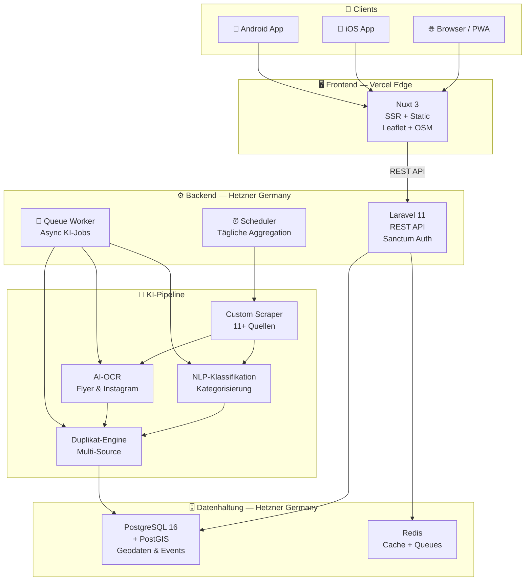

# Lockaly — Systemarchitektur

> Öffentliche High-Level-Übersicht der technischen Architektur. Interne Implementierungsdetails und sensible Systemkomponenten bleiben privat.

---

## 🏛️ Architektur-Philosophie

Lockalys Architektur folgt drei Kernprinzipien:

- **DSGVO by Design** — Datenschutz ist keine nachträgliche Anforderung, sondern architektonische Grundlage
- **Modularer Monolith** — Klare interne Schichttrennung mit der Flexibilität, bei Bedarf zu skalieren
- **Hyperlocal-First** — Geografische Präzision als technischer Schwerpunkt auf jeder Ebene

---

## 🔭 High-Level Übersicht

```
┌─────────────────────────────────────────────────────────────────┐
│                          NUTZER                                 │
│            Browser · PWA · iOS App · Android App                │
└──────────────────────┬──────────────────────────────────────────┘
                       │ HTTPS
┌──────────────────────▼──────────────────────────────────────────┐
│                  FRONTEND — Vercel Edge CDN                     │
│                    Nuxt 3 (SSR + Static)                        │
│          SEO-optimiert · Hydration · PWA · i18n                 │
└──────────────────────┬──────────────────────────────────────────┘
                       │ REST API / JSON
┌──────────────────────▼──────────────────────────────────────────┐
│               BACKEND — Hetzner Cloud (Germany)                 │
│                    Laravel 11 · PHP 8.3                         │
│       Auth · Geschäftslogik · Geo-Routing · Event-API           │
└─────────┬─────────────────────────────────────┬─────────────────┘
          │                                     │
┌─────────▼──────────────┐         ┌────────────▼────────────────┐
│  DATENBANK             │         │  KI-PIPELINE                │
│  PostgreSQL 16         │         │  Aggregation · NLP · OCR    │
│  + PostGIS             │         │  Dedup · Multi-Model        │
│  Geo-Daten · Events    │         │  Fallback · Scheduler       │
│  Nutzer · Statistiken  │         │  (11+ Quellen täglich)      │
└────────────────────────┘         └─────────────────────────────┘
          │
┌─────────▼──────────────┐
│  CACHE & QUEUES        │
│  Redis                 │
│  Session · Jobs · CDN  │
└────────────────────────┘
```

---

## 🧩 Architektur-Diagramm (Mermaid)



---

## 📦 Komponenten im Detail

### 🖥️ Frontend — Nuxt 3

Das Frontend ist als **SSR-Anwendung** auf dem Vercel Edge Network deployed und liefert gleichzeitig die Grundlage für die Mobile Apps (via Capacitor).

| Eigenschaft | Detail |
|:---|:---|
| **Rendering** | Server-Side Rendering (SSR) für optimale SEO und Core Web Vitals |
| **Deployment** | Vercel Edge Network — globale Auslieferung, minimale Latenz |
| **Karten** | Leaflet + OpenStreetMap — datenschutzfreundlich, kein Google Maps |
| **PWA** | Installierbar, offline-fähig, Push-fähig |
| **Mobile** | Direkte Integration mit Capacitor 6 (iOS + Android aus einer Codebase) |

---

### ⚙️ Backend — Laravel 11

Das Backend ist ein **modularer Monolith** mit klarer interner Schichttrennung — optimiert für die Anforderungen einer hyperlokalen Event-Plattform.

| Eigenschaft | Detail |
|:---|:---|
| **API-Stil** | RESTful JSON-API für alle Clients (Web, iOS, Android) |
| **Authentifizierung** | Laravel Sanctum — Token-basiert, SPA-kompatibel |
| **Geo-Routing** | PostGIS-gestützte Radius- und Polygon-Abfragen |
| **Queue-System** | Asynchrone KI-Verarbeitung und Event-Aggregation via Redis |
| **Scheduler** | Automatisierte tägliche Datenaggregation aus 11+ Quellen |
| **Skalierung** | Stateless API-Server — horizontales Scaling ohne Architekturänderungen |

---

### 🗄️ Datenbank — PostgreSQL 16 + PostGIS

PostgreSQL mit PostGIS-Erweiterung ist das **technische Herzstück** der hyperlocal Architektur.

| Eigenschaft | Detail |
|:---|:---|
| **Geo-Abfragen** | Radius-Suche (500 m), Stadtteil-Polygone, Distanzberechnungen |
| **Volltextsuche** | Native PostgreSQL Volltext-Suche — kein separater Search-Index nötig |
| **Indizierung** | Optimierte GiST-Indizes für hyperlokale Geo-Abfragen |
| **Hosting** | Hetzner (Deutschland) — DSGVO-konform, keine Drittland-Transfers |
| **Replikation** | Vorbereitet für Multi-Region-Replikation bei Skalierung |

---

### 🤖 KI-Pipeline

Die KI-Pipeline ist vollständig **automatisiert und asynchron** — Events werden täglich aggregiert, klassifiziert, verifiziert und dedupliziert.

| Funktion | Beschreibung |
|:---|:---|
| **Event-Aggregation** | Automatisierte Erfassung aus 11+ Quellen täglich via Custom Scraper |
| **AI-OCR** | Extraktion von Event-Daten aus Flyern und Instagram-Bildern |
| **NLP-Klassifikation** | Semantische Kategorisierung von Events nach Genre, Zielgruppe, Ort |
| **Duplikat-Erkennung** | Verhindert doppelte Events aus verschiedenen Quellen |
| **Qualitätsprüfung** | Automatische Verifikation und Anreicherung der Event-Daten |
| **Multi-Model-Fallback** | Ausfallsicherheit durch automatischen Wechsel zwischen Modellen |

---

### 📱 Mobile — Capacitor 6

Die Mobile Apps basieren zu 100 % auf der Nuxt 3 Web-App — kein separates Framework, kein Code-Split.

| Eigenschaft | Detail |
|:---|:---|
| **Codebase** | Eine einheitliche Codebase für Web, iOS und Android |
| **Native Features** | GPS, Push-Notifications, Kamera via Capacitor-Plugins |
| **Plattformen** | iOS 16+ (App Store) und Android 10+ (Play Store) |

---

## 🔒 Datenschutz & Sicherheit

Datenschutz ist bei Lockaly kein Feature — es ist ein **architektonisches Prinzip**.

| Maßnahme | Detail |
|:---|:---|
| **EU-Hosting** | Alle Daten auf Hetzner-Servern in Deutschland — keine Drittland-Transfers |
| **Keine Datenweitergabe** | Keine Integration von Google Analytics, Facebook Pixel oder ähnlichen Tracking-Diensten |
| **Cookiefreie Analytics** | Plausible Analytics — DSGVO-konform ohne Cookie-Consent-Banner |
| **Open-Source-Karten** | Leaflet + OpenStreetMap — keine Google-Maps-Datenweitergabe |
| **Minimale Datenerhebung** | Plattform vollständig ohne Account nutzbar |
| **DSGVO-Dokumentation** | Alle Datenverarbeitungen dokumentiert und rechtskonform |

---

## 📈 Skalierbarkeit

Die Architektur ist von Grund auf für horizontales Wachstum ausgelegt:

| Komponente | Skalierungs-Strategie |
|:---|:---|
| **API-Server** | Stateless — beliebig horizontal skalierbar hinter Load Balancer |
| **Queue-Worker** | Unabhängig skalierbar nach KI-Verarbeitungslast |
| **Frontend** | Automatisches Scaling via Vercel Edge CDN |
| **Datenbank** | Read-Replicas vorbereitet; PostGIS optimiert für hohe Geo-Query-Last |
| **Cache** | Redis-Cluster-fähig bei steigender Nutzerzahl |

**Aktueller Fokus:** Düsseldorf als Pilotmarkt · **Nächste Ausbaustufe:** NRW — Köln, Ruhrgebiet (2026/27)

---

*Zuletzt aktualisiert: Mai 2026*
